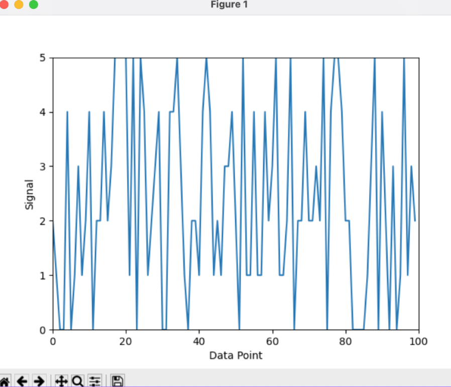

# Low-Noise Amplifier Application
> This part of the code is a component of a group project focused on creating an application for controlling parameters of a low noise amplifier.

## Table of Contents
* [General Info](#general-information)
* [Technologies Used](#technologies-used)
* [Features](#features)
* [Screenshots](#screenshots)
* [Setup](#setup)
* [Project Status](#project-status)
<!-- * [License](#license) -->

## General Information
The application allows for:
- Communication with the embedded system of the amplifier, enabling parameter configuration.
- Selection of amplifier operation parameters, such as the gain of the second-stage amplifier and the signal reception bandwidth.
- Displaying results in the time domain with a delay of no more than 0.5 seconds.
- Saving results to a file for later processing or analysis.

## Technologies Used
- Python - version 3.11.0
- Matplotlib - version 3.7.1
- Pyserial - version 3.5

## Features
- Real-time signal visualization with low latency.
- Configurable amplifier settings including gain and bandwidth.
- Export results to CSV file for easy data storage and analysis.

## Screenshots

<!-- If you have screenshots you'd like to share, include them here. -->

## Setup
To set up the project, follow these steps:

- Make sure you have the Python interpreter installed on your computer. You can download the latest version from Python.org. 
- Clone the repository: git clone 'https://github.com/akiszkiel/Breast-Cancer-Prediction-App.git'.
- Install dependencies: 'pip install -r requirements.txt'.
- Run the application: 'python main.py'.

## Project Status
Project is: _complete_.
